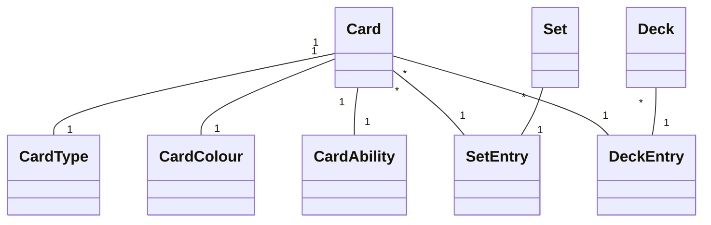

# Project .NET Framework

* Naam: Kobe Ponet
* Studentennummer: 0160514-76
* Academiejaar: 23-24
* Klasgroep: INF203A
* Onderwerp: Magic the gathering -> Set * - * Card * - * CardType

## Sprint 3


## Sprint 4


## Sprint 6

### Nieuwe Set

#### Request

```http request
POST https://localhost:7101/api/Sets
Content-Type: application/json
Accept: application/json

{
  "name": "New Set",
  "code": "NS",
  "releaseDate": "2023-01-01"
}
```

#### Response

```http request
HTTP/1.1 201 Created
Content-Type: application/json; charset=utf-8
Date: Tue, 26 Dec 2023 16:54:27 GMT
Server: Kestrel
Location: https://localhost:7101/api/Sets/5
Transfer-Encoding: chunked

{
  "id": 5,
  "name": "New Set",
  "code": "NS",
  "releaseDate": "2023-01-01T00:00:00"
}
```
## Sprint 7

### new set without authentication

#### Request

```http request
POST https://localhost:7101/api/Sets
Content-Type: application/json
Accept: application/json

{
  "name": "New Set 2",
  "code": "NS2",
  "releaseDate": "2023-01-01"
}
```

#### Response

```http request
<Response body is empty>Response code: 401 (Unauthorized); Time: 54ms (54 ms); Content length: 0 bytes (0 B)
```
### new set with authentication

#### Request

```http request
# @no-redirect
# @no-cookie-jar
POST https://localhost:7101/api/Sets
Content-Type: application/json
Accept: application/json
Cookie: .AspNetCore.Identity.Application=CfDJ8H9KMD2CQ61Gtuxgcoy7Jc3h_yWXu_nXvFemKY0pENhN4-gue6q4a91TfOQR0Vm349CKUNxLUpwKY7myGpj-UOxJzme3bA0Ay_VhyEvvayN1DGBPTHQyRC2Y11GZ91_Vy6GLb1Z1NsDm_wWqcV61bI38VlAw-S8O-mfmaZg9R7Uh9W-Lg_qeBxU4qFI35nhPJ1283FuGUhkIfFiSyATt3LpWJEBCEiBD6yD6lnBQQfZsL6zjAQqTQc9xoWek1BIjI1bpMp0YlHo7Qgl5_0ib-8JTGlsq23nU0QzWWxfVxa9LwRlFv6yzh_ndCFSHHG7oEUT0wWTgwX1vr_1L1mrPkyX8pxoIhwYqsdCa1iml8SBsOkEqJDZ7lrfrCDvv1wTv-8d7JbzvzzoB0qbX9wFCDFmI4cRrtnEDGwYCuAvnWrJ2uN_VkyyT-jXveL3kGeTYiXk_47n-drtkK8m0UvMNztZHpI8GBuK8gqOeKfYdtJQLNAz8MsstUpZBkgS4N-YSHbOABHwKYHNGVZ1CP9wEmmPflCXEk0twcuAli94v_xSxKuulQOdI3YZDud5pyf9IiK8-WuwPA6iD1Dar5O1DJ24UzffntmOk5NeJsM_wXLzl7hEOUSQA3Q-fOqweLG2PPW_RhK2LHYzKvNL7y4l3SyeP-A98qDB8Sf1LTc5EVBINJ9_oLwKFVeV5N7zjto7hWN0NbCYdCadgd1TqVs5_oJV2jthUYf7zfqL-NTD7vlO_UIZJgFQl2Rjd3Ox3YVyMlb-Q0t2PqyScW57vOAUl2UA4YF2EjRqyYvmNSK-HBgo2kemB362ozzYzP9vVWoyHvw

{
  "name": "New Set 2",
  "code": "NS2",
  "releaseDate": "2023-01-01"
}

```

#### Response

```http request
Response code: 201 (Created); Time: 121ms (121 ms); Content length: 76 bytes (76 B)
```

## Sprint 8

```shell
dotnet test
```


