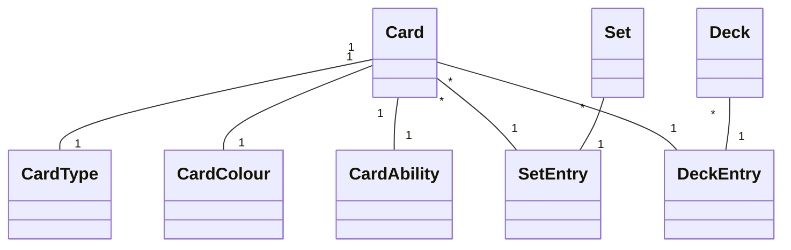

# Project .NET Framework

* Naam: Kobe Ponet
* Studentennummer: 0160514-76
* Academiejaar: 23-24
* Klasgroep: INF203A
* Onderwerp: Magic the gathering -> Set * - * Card * - * CardType

## Sprint 3

## Sprint 4
