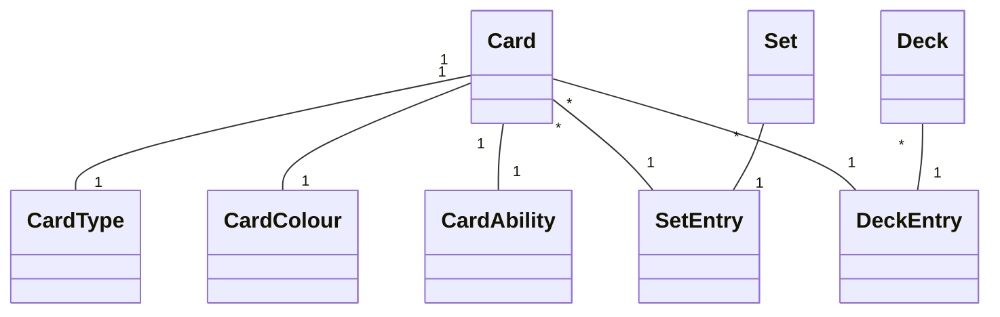

# Project .NET Framework

* Naam: Kobe Ponet
* Studentennummer: 0160514-76
* Academiejaar: 23-24
* Klasgroep: INF203A
* Onderwerp: Magic the gathering -> Set * - * Card * - * CardType

## Sprint 3


## Sprint 4


## Sprint 6

### Nieuwe Set

#### Request

```http request
POST https://localhost:7101/api/Sets
Content-Type: application/json
Accept: application/json

{
  "name": "New Set",
  "code": "NS",
  "releaseDate": "2023-01-01"
}
```

#### Response

```http request
HTTP/1.1 201 Created
Content-Type: application/json; charset=utf-8
Date: Tue, 26 Dec 2023 16:54:27 GMT
Server: Kestrel
Location: https://localhost:7101/api/Sets/5
Transfer-Encoding: chunked

{
  "id": 5,
  "name": "New Set",
  "code": "NS",
  "releaseDate": "2023-01-01T00:00:00"
}
```
